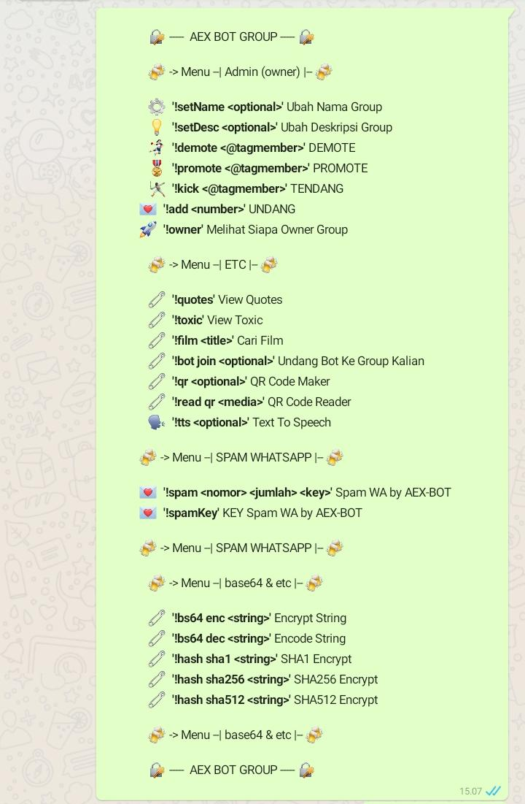

# aex-bot

### Installation Steps

1. `$ cd aex-bot`
1. `$ npm i`
2. `$ npm start`

``Note : runing at port 3000``

### Usage
<pre>
After scan barcode whatsapp, you can stat message with following command : !help for showing menu/command
</pre>

### Menu
<pre>
🔐 -----  AEX BOT GROUP ----- 🔐

🍻 -> Menu --| Admin (owner) |-- 🍻

⚙  *'!setName <optional>'* Ubah Nama Group
💡  *'!setDesc <optional>'* Ubah Deskripsi Group
🤾🏻‍♀  *'!demote <@tagmember>'* DEMOTE
🎖  *'!promote <@tagmember>'* PROMOTE 
🤺  *'!kick <@tagmember>'* TENDANG
💌  *'!add <number>'* UNDANG 
🚀  *'!owner'* Melihat Siapa Owner Group 

🍻 -> Menu --| ETC |-- 🍻

🧷  *'!quotes'* View Quotes
🧷  *'!toxic'* View Toxic 
🧷  *'!film <title>'* Cari Film
🧷  *'!bot join <optional>'* Undang Bot Ke Group Kalian
🧷  *'!qr <optional>'* QR Code Maker
🧷  *'!read qr <media>'* QR Code Reader
🗣  *'!tts <optional>'* Text To Speech

🍻 -> Menu --| SPAM WHATSAPP |-- 🍻

💌  *'!spam <nomor> <jumlah> <key>'* Spam WA by AEX-BOT
💌  *'!spamKey'* KEY Spam WA by AEX-BOT

🍻 -> Menu --| SPAM WHATSAPP |-- 🍻

🍻 -> Menu --| base64 & etc |-- 🍻

🧷  *'!bs64 enc <string>'* Encrypt String
🧷  *'!bs64 dec <string>'* Encode String 
🧷  *'!hash sha1 <string>'* SHA1 Encrypt
🧷  *'!hash sha256 <string>'* SHA256 Encrypt
🧷  *'!hash sha512 <string>'* SHA512 Encrypt

🍻 -> Menu --| base64 & etc |-- 🍻

🔐 -----  AEX BOT GROUP ----- 🔐
</pre>

## Screenshots

